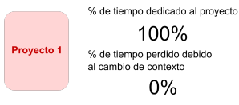

# Tema 1: Peopleware

De nada sirve tener un hardware y software potente si no se ssaca el rendimiento de los trabajadores. Se busca productividad en relación a los medios empleados y como estos son aprovechados.

## Introducción

**Peopleware** es un término que hace referencia a todo lo relacionado con el factor humano en el desarrollo de software. Ej: productividad, personalidad, etc.

- `DeMarco&Lister` Se encuentran más problemas sociales que tenológicos en el desarrollo de software.
- `McConnell` Las personas son las que más potencial tienen para disminuir la duración de un proyecto.

## Características de equipos productivos

### Selección

Un jefe debe:
- Elegir personal adecuado buscando un equilibrio entre libertad y comodidad del trabajador. 
- Debe generar sentimiento de comunidad para crear permanencia para así evitar meses de formación en nuevos empleados( estimación 3 meses aprox.). Esto puede generar adicionalmente distración en el personal ya incorporado por la resolución de dudas de los nuevos.

Para comprobar la motivación de cada trabajador se puede hacer uso de un calendario Niko-Niko. Este calendario solo funciona si los trabajadores depositan su confianza y son transparentes.

Este calendario permite detectar problemas en el equipo. Un ejemplo de problemas sería:
- Tipo de actividad
- Factores externos
- Sobrecarga de trabajo
- Distribución geográfica

Algunos de estos problemas se pueden identificar con patrones. Otros no son tan faciles de detectar por lo que el lider puede tener reuniones en privado/público con los trabajadores para generar un espacio seguro.

### Entorno de trabajo

Se debe de tener en cuenta aspectos como:
- Espacio/ambiente
- Tiempo de trabajo en solitario y en grupo
- El ruido

Hay que luchar contra la interrupciones externas (10-15 minutos se tarda en recuperarse de una interrupción). Se puede aplicar códigos o señales visuales para mitigarlos. Ejemplo: llevar auriculares es señal de no molestar. También se puede hacer un mecanismo asíncrono de solicitud de ayuda.

Hay otros métodos más sofisticados como el método Pomodoro. Este método consiste en trabajar 25 minutos y descansar 5 minutos. Después de 4 pomodoros se descansa 15-20 minutos.

P = Pomodoro. D = Descanso. DG = Descanso grande

**P -> D -> P -> D -> P -> D -> P -> DG -> P -> D -> P -> D -> P -> D -> P -> DG...**

Otros factores que afectan:

- Programar con música -> Afecta al hemisferio derecho(encargado de la creatividad) -> Desaparecen ideas felices y concentración total de ambos hemisferios.
- La cantidad de trabajos en paralelo:
    - 
    - 
    - 

Un método para limitar el número de tareas sería el método Kanban de Strum con WIP (Work in Progress). Este método consiste en tener un tablero con 3 columnas: To do, In Progress, Done. Se puede añadir una columna más para las tareas que se han quedado a medias. Aquí puedes poner como limitación el número de tareas que se pueden tener en la columna In Progress.

### No calidad

El cliente establece el nivel de calidad ( aconstumbrados de 1 a 3 defectos cada º00 lineas de código). Bajo presión de tiempo se suele sacrificar la calidad con malas prácticas como duplicación de código o código spaghetti. Más alla de satisfacer la necesidades del usuario final. La calidad del software debe de verse como una forma de mejorar la productividad. Ejemplo: los japoneses piensan que ⬆ calidad -> ⬇ coste. Otro ejemplo sería HP.

### Cantidad de personal

Según Putnam:
1. El tamaño óptimo de un equipo es de 5-7 personas.
2. Los equipos pequeños tienen ventajas sobre los grandes:
    - El tamaño hace que perder una persona no sea tan grave.
    - Los miembros se comunican de forma más cercana y fluida, menos malentendidos y mayor coordinación.

- `F. Brooks` Añadir gente a un proyecto atrasado lo retrasa más.

Si tu empresa tiene equipos grandes se debería de realizar una subdivisión de estos en equipos más pequeños.

### Multifuncionalidad

Si una persona es multifuncional, dependerá menos de otros equipos, áreas o roles externos. Hay tablas que permiten saber si tu equipo es multifuncional o no. Ejemplo:

Un equipo es totalmente funcional cuando en cada columna todos los miembros del equipo tienen al menos un **.** (Se defienden en la tarea) o un **✡** (Son expertos en la tarea).

**¿Por qué es importante evaluar la multifuncionalidad?**

1. Al evaluar las habilidades de los miembros del equipo, surgen conversaciones sobre cómo cada miembro puede contribuir de manera más efectiva.
2. Se ven las fortalezas y debilidades del equipo.
3. Hay más trabajo en equipo y evita que una sola persona sea la única que sepa hacer una tarea.
4. Los miembros se entienden mejor y si lo desean pueden aumentar su conocimiento en otras áreas enriqueciendo al equipo.

En resumen, un equipo productivo debe ser/tener:
- Personal adecuado
- Entorno de trabajo adecuado
- Tratar la no calidad
- Cantidad de personal adecuada
- Multifuncionalidad

### Modelos de mejora de la calidad
En otras asignaturas como GPDS ya tratemos con dos de los 3 modelos de mejora de la calidad. Estos son:
- Modelo CMMI: Busca mejorar las capacidades de las organizaciones.
- Modelo PSP: Busca mejorar las capacidades de los individuos.

El tercer modelo es el modelo TSP. Este modelo busca mejorar las actuaciones de los equipos y el enfoque del producto.

**TSP: Team Software Process**
Busca guiar a los ingenieros y a los diretivos en como formar equipos de trabajo y como gestionarlos. Para poder llevarlo a cabo, cada miembro debería tener experiencia previa en PSP.

### Principios de formación de los equipos

Todos los miembros del quipo deben colaborar en las siguientes fases mostradas en la imagen:

Una vez todos saben que papel desempeñar deben trabajar de la forma planeada comprometiendose con sus labores. 

El lider del equipo debe desempeñar las siguientes funciones:
- Guiar, motivar y vigilar a los miembros del equipo.
- Gestionar incidencias
- Informar a la dirección en cada momento del estado actual del proyecto y los trabajadores.

