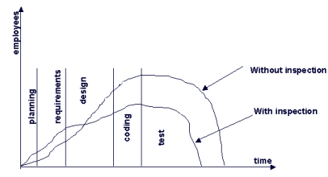
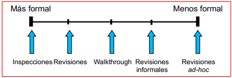
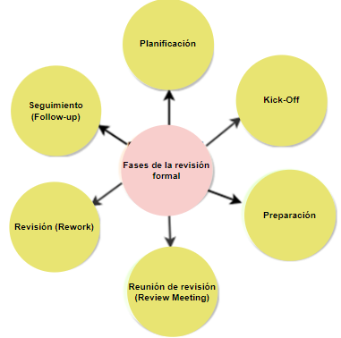

# Tema 3

## Introducción

Las revisiones técnicas son el filtro más efectivo para controlar la calidadd en el proceso de desarrollo del software. Te permiten ver errores en etapas tempranas y son aplicables a cualquier producto intermedio (requisitos faltantes en SRS, defectos en diseño, código no mantenible, etc.).

- `Norma IEEE 1020-2008` Un estándar que proporciona directrices sobre revisiones, auditorías y métodos relacionados con la calidad del software.

## Coste de las revisiones

Vamos a ver una gráfica que explica el coste de las revisiones en función de la etapa en la que se detecta el error:

Hay dos lineas:

- **Sin revisiones**: El esfuerzo aumenta a lo largo del ciclo de desarrollo. El mayor punto sucede en las fases de prueba y correción de errores.
- **Con revisiones**: Aunque el esfuerzo aumenta en las etapas iniciales, disminuye en las etapas finales. El coste total es menor. Pueden detectar más del 60% de los errores.

Las **revisiones estáticas** generan observaciones y comentarios que permiten detectar errores en etapas tempranas. Esto supone ciertas ventajas:

- Tienes menos interrupciones por errores -> Aumento de la **productividad**.
- Al hacer revisiones continuas, el equipo **participa** e **intercambia** información con el resto del equipo. Esto genera una **conciencia sobre la calidad** del producto.

Para estas revisiones, se puede establecer como política de revisión que los programadores vean con herramientas automáticas zonas del código más propensas a errores. Un ejemplo de estas herramientas son:

- **Checkstyle**
- **PMD**
- **FindBugs**
- **SonarQube**

## Tipos de revisiones

Según el grado de formalidad, se pueden clasificar en según la Figura 2.

Antes de empezar con los tipos de revisiones, vamos a explicar los roles que intervienen en ellas:

**Moderador** 

Lidera la revisión definiendo de que tipo es y cual es la composición del equipo. Planifica las reuniones, organiza los documentos, modera las discusiones. También supervisa correcciones.

**Autor**

Escribe el documento que se va a revisar. Busca mejorar la calidad del contenido, explicando partes poco claras y entiende los defectos señalados.

**Secretario**

Anota los errores encontrados y las sugerencias. Suele ser el autor del documento.

**Revisor**

Son expertos que identifican errores y aportan desde su conocimiento técnico o del dominio específico.

### Revisiones Ad-hoc

Es una revisión informal y espontánea. Una persona solicita ayuda a otra sin preparación previa. Suele ser útil para encontrar errores simples y resolver dudas inmediatas.

### Revisiones informales

Sin preparación previa, documentación o seguimiento de errores. Se puede hacer mediante **peer deskcheck** (un compañero revisa el trabajo del otro) o grupal mediante **reuniones informales**.

### Walkthrough

Técnica de revisión con aspectos informales liderados normalmente por el autor del documento que realiza la mayor parte de la preparación. 

Buscas generar un entendimiento común (presentar, explicar y evaluar) del documento y obtener retroalimentación. Va dirigido a un amplio grupo donde participan:

- **Autor** del documento.
- **Secretario** (si lo hay o el mismo autor).
- **Participantes** sin preparación previa. Pueden asistir los **Stakeholders**.

Esto es útil para documentos generales de alto nivel, como especificaciones de requisitos.

### Revisiones

Es una técnicas de revisión más formal que el walkthrough. Se prepara con antelación y se sigue un procedimiento que veremos a continuación. Ver Figura 3.

**Planificación**

1. Comienza por petición del autor al moderador. 

2. Se establecen los **criterios de entrada**:

- El moderador hace una vista previa para ver que no halla fallos importantes. 
- Se númera el documento. Se le aplica alguna herramienta automática para limpiarlo.
- Autor está preparado para responder preguntas.

3. Se establecen los **criterios de salida**:
- Numero medio de defectos importantes/página.

Si no se cumplen los criterios de entrada, se pospone la revisión y si no se cumplen los criterios de salida, se puede llegar a repitir la revisión.

4. Se determina el equipo de revisores para cada aspecto del documento (4-6 personas incluyendo autor/moderador).

**Kick-off**

Es opcional pero muy recomendable. Conviertes a los revisores más efectivos.

1. Compruebas que todos comparten las mismas ideas en relación al documento.
2. Se introduce a los revisores sobre cuales son los objetivosde la revisión, cuales son los aspectos a tratar y los documentos a revisar. Estos pueden discutir los aspectos impuestos en la planificación.

**Preparación**

Cada participante trabaja de forma individual en el documento. Según los conocimientos que posea, encontrará y se enfocará en diferentes errores. Las faltas de ortografía se marcan pero no se mencionan. 

Para mejorar la efectividad se suele usar checklist (listas de comprobación). Ha sido un éxito si el **ratio de comprobación** (número de páginas revisadas por hora) es alto.

**Reunión de revisión**

Basada en tres fases:

- **Logging phase (fase de registro)**: Se mencionan los defectos encontrados página a página con un nivel de severidad (crítico, mayor, menor). También se pueden mencionar aspectos positivos como sugerencias de mejora o solicitudes de cambio.
- **Discussion phase (fase de discusión)**: Se discuten los defectos encontrados evitando cuestiones personales. Se busca entender el problema y encontrar soluciones. Se documentan las decisiones tomadas.
- **Decision phase (fase de decisión)**: Se decide si se acepta o no el documento basandose en los criterios de salida. Si se acepta, el moderador o los participantes revisarán el documento durante la fase de seguimiento. Se puede aceptar teniendo errores si se ve con presiones del proyecto.

**Revisión**

El autor mejora el documento en base a los defectos encontrados. No todos los defectos requieren modificaciones, y el autor decide cuáles deben corregirse. Además, el autor debe informar sobre los aspectos no tratados para que consten, y el documento debe reflejar claramente los cambios realizados.

**Seguimiento**

El documento aprobado en la fase de revisión se revisa por el moderador para ver si se han corregido los defectos encontrados, tenido en cuenta las sugerencias y solicitudes de cambio.

Puede ser que se le solicite a cada partipante revisar el documento actualizado y dar feedback de vuelta al moderador.

### Inspecciones

Es el tipo de revisión más formal. Es por ello que el documento previamente se revisa de forma exhaustiva antes de la reunión. Se hace uso de reglas y checklists. Cómo se hacia en las revisiones formales, no se discuten los defectos hasta la fase de discusión. Participan:

Busca lo mismo que las revisiones formales pero con mayor rigor. Piensa en entrenar a **nuevos empleados** en el proceso de desarrollo de la organización.

- Dirigida por **moderador entrenado** (no por autor).
- **Peers**: encargados de revisar el producto.

La preparación es más intensiva que en las revisiones formales. Se usan reglas/checklists y los defectos son apuntados en **logging list**/**issue log**. El moderador realiza como en las RF una fase de seguimiento en las que aplica los criterios de salida y se recogen métricas para propiciar a la mejora continua.

## Auditoría de software

Un tercero externo a la organización realiza una evaluación para ver si los productos/procesos software son conformes a las leyes, estándares, guías, etc. Ejemplo de producto: plan de instalación. Ejemplo de proceso: ciclo de vida del software.

**Roles**

- **Iniciador**: ve que es necesario una auditoría. Elabora los alcance/objetivos y designa un auditor líder. Decide las acciones de seguimiento y distribuye el informe de auditoría.
- **Secretario**: misma función mencionada en las revisiones.
- **Auditor Lider**: puede ser también el secretario. Planifica y reune a los auditores. Si tiene dudas, discrepancias o inconformidad con los auditores, se las comunica al iniciador. Al final de la auditoría, le entrega un informe de auditoría al iniciador.
- **Auditor/es**: revisan los productos/procesos software. Pueden ser internos o externos a la organización.
- **Organización auditada**: proporciona la información necesaria para la auditoría.

## Auditoría informática

Consiste en recopilar, analizar y evaluar evidencias para garantizar que un sistema informático:

- Protege los activos.
- Mantiene la integridad de los datos.
- Cumple eficazmente los objetivos de la organización.
- Optimiza el uso de recursos.

Para ser **auditor informático** se necesita:

- Superar el examen
- Aportar cv de experiencia previa 5 años auditando
- Firmar código ético
- Pagar tasa de ISACA (asi obtener certificación CISA)

Si dejas de ejercer y no acreditas las horas suficientes, pierdes la certificación.

### Auditoría de ofimática

Sistema informatizado que gestiona los datos de la oficina. Según el departamento se emplean unas aplicaciones u otras. Ciertas características se adaptan a usuarios finales no técnicos. 

Algunos problemas que se pueden encontrar son:

- Desarrollo de aplicaciones ad-hoc ineficaces.
- Uso de copias ilegales de software.
- Ausencia de documentación insuficiente.

### Auditoría de licencias de software

Se encarga de verificar si se cuenta con el número adecuado de licencias. Hay dos tipos de auditorías:

- **Auditoría interna**: se realiza inventario de que software hay instalado y se compara con las licencias adquiridas.
- **Auditoría externa**: se realiza por un tercero como BSA (Business Software Alliance).

Si no se posee la licencia correspondiente y eres descubierto, hay riesgo de:

- Perder futuros contratos públicos
- Acceso denegado a la financiación y créditos para la actividad de la empresa
- Acceso denegado a subvenciones de Pedro Sánchez
- Perdida de certificaciones de calidad
- Denuncia al personal implicado.

## Gestión de Activos de Software (SAM)

Saber qué software tiene, dónde está instalado y si existen solapamientos de licencias.

- `UNE-ISO/IEC 19770-1` es su norma de referencia.
- `2001 AENOR` crea el primer certificado europeo orientado a controlar la gestión de activos de software y el cumplimiento de la ley de propiedad intelectual vigente.

Los pasos que sigue esta metodología son:

1. **Realización de inventario de software**: Que tiene cada ordenador
2. **Verificación de correspondencia entre programas instalados y licencias adquiridas**
3. **Revisión de políticas y procedimientos de gestión legal del software**
4. **Desarrollo de un plan de acción de gestión de activos de software**: ver que se necesita y formación de los trabajadores en el uso de software.

Hay diferentes tipos de herramientas SAM:

- **Herramientas de gestión de activos**: llevar un inventario del software instalado y documentaciones
- **Herramientas de detección**: buscar software instalados en el ordenador. Ejemplo: ZENworks® Asset Management.
- **Herramientas de medición**: controlar frecuencia de uso y ver si la licencia es necesaria
- **Herramientas de gestión de licencias**: aún no hay destacables y se debe hacer manualmente.

## Auditorías Externas y BSA

El proceso de selección de una empresa a auditar es totalmente arbitrario. A veces se suele sospechar de compañías. El término **BSA** (Business Software Alliance) se refiere a una asociación comercial sin ánimo de lucro que se dedican a la protección de la propiedad intelectual de los proveedores de software.

