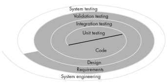
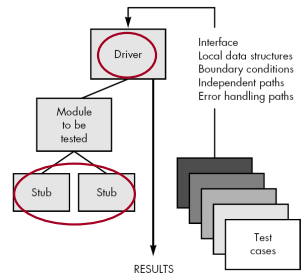
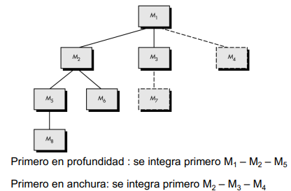
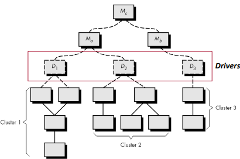

# Tema 4

## Introducción

Las pruebas son complementarias con las revisiones vistas en el tema anterior. Ambas comprueban la calidad del software, garantizan que se cumplan los requisitos del cliente y poder encontrar errores. Suelen ser lo que mayor esfuerzo requiere dentro del proceso de desarrollo por lo que hay que realizarlas siendo precisos para no perder tiempo y esfuerzos.

## Estrategias de prueba

Como ya realicemos en la práctica 3, toda prueba debe de especificar:

- **Plan de pruebas**: pasos que se van a dar como parte de la prueba, tiempo, recursos y esfuerzo.
- **Casos de prueba**: diseñar una serie de casos que cubran todas las posibles situaciones que se puedan dar.
- **Ejecución de pruebas**: llevar a cabo los casos de prueba.
- **Registro de resultados**: anotar los resultados obtenidos. Se esperará unos resultados que serán comparados con los resultados de las ejecuciones.

El estándar `IEEE 829-2008` muestra directrices para la documentación de pruebas de software. 

**Características de las estrategias**

1. Deberían de hacer revisiones técnicas antes de las pruebas para reducir el número de errores. 
2. Deberían de ser realizadas por personal que no haya participado en el desarrollo del software. 
3. Se empieza probando los componentes hasta llegar a la prueba del sistema completo. 
4. Las pruebas dependerán del modelo de desarrollo del software. 
5. Las estrategias de pruebas deben ofrecer una orientación clara y detallada sobre cómo realizar las pruebas además de marcar puntos específicos en el proceso de pruebas que permitan a los directivos evaluar el progreso.

**etapa de pruebas != etapa de depuración**

## Niveles de prueba

Hay diferentes tipos de prueba. En la Figura 1 se parte en el centro de la base del desarrollo: el código. A partir de ahí se generan pruebas de unidad, que se prueban en el nivel de componente. Una vez comprobada la funcionalidad se generan pruebas de integración, que evaluan la interación entre módulos. Una vez este todo integrado, se realizan pruebas de validación para ver si se cumplen todos los requisitos. Si la respuesta es afirmativa entonces se evaluan todos los componentes como un todo integrado (pruebas de sistema).

Antes de introducirnos en los diferentes tipos de pruebas, vamos a introducir dos nuevos conceptos:

- **Driver**: Un driver es un controlador que realiza llamadas (métodos en OO) a un componente/módulo mediante unos datos (atributos en OO) de entrada y recoge/imprime los resultados obtenidos. Simula el comportamiento del sistema.

- **Stub**: Un stub es un módulo que simula el comportamiento de un componente/módulo real no implementado. No implementa una lógica real, sino que presenta una serie de valores o acciones por defecto. 

Estos pueden provocar sobreesfuerzo al no ser parte del trabajo a entregar.

**Reglas generales de las pruebas**

1. Probar primero lo más simple y pruebas límite.
2. Los asertos deben tener nombres identificativos del error y deben de ser mínimos.
3. Test independientes.
4. Evitar mostrar mensajes de error por pantalla y redefinir el método toString.

**Ventajas de un framework de pruebas**

- Automatización de las pruebas.
- Facilitan el refactoring y aseguran que no se introduzcan nuevos errores.
- Permiten modificar la implementación o pruebas sin afectar al otro.
- Los errores son más fáciles de identificar y corregir.

Ejemplos de frameworks de pruebas son **JUnit**, **TestNG**, etc.

### Pruebas de unidad

Se centran en la unidad lógica más pequeña: módulo/componente (en OO, hablamos de una clase). En OO, hablamos de pruebas de clase como su equivalencia. Si los módulos son independientes, se pueden probar de forma aislada en paralelo. El creador del módulo suele realizar los tests centrandose en cubrir todos los caminos independientes básicos y los caminos de error. Debe comprar que se hace una correcta gestión de los errores evaluando el módulo tanto en límites válidos como no válidos. Durante el proceso de prueba, se debe comprobar la entrada y salida junto con la integridad de los datos locales en la ejecución.

Un enfoque práctico consiste en realizar los test previamente a la creación del módulo. De esta forma el código se va desarrollando buscando que los test sean aceptados. Esto obliga a generar stubs y drivers para simular el comportamiento de los módulos que aún no han sido implementados.

Estas pruebas no descubren todos los errores, solo los que se pueden encontrar en el módulo. Puede darse el caso de que falte parte de implementación (error) pero eso no se descubra hasta que se realicen pruebas de integración.

En la Figura 2 vemos como el driver simula al sistema que llama al módulo (JUnit sería un ejemplo de esto). Este se apoya en componentes sin implementar gracias a la ayuda de stubs. De esta manera, ambos permiten aislar el módulo bajo prueba y centrarse en el comportamiento del mismo.

**¿Qué es una buena prueba unitaria de calidad?**

Aquella que es `ACRI`: Automática, Cobertura, Repetible e Independiente.

### Pruebas de integración

Técnica de generación de pruebas para comprobar la interacción entre módulos. Hay que identificar los módulos críticos y los que tienen más dependencias.

**¿Cúando un módulo es crítico?**
- Cuando tiene varios requisitos software o de rendimiento, es complejo o propenso a errores. Hay dos enfoques:

#### Enfoque BIG BANG

Se integran todos los módulos al mismo tiempo. Es el más sencillo pero también el más arriesgado. Si falla, no se sabe qué módulo ha fallado. Puede entrar en un bucle infinito de pruebas.

#### Enfoques integración incremental

Se integran los módulos de forma progresiva. Se empieza por los módulos que puedan ocasionar mayores problemas. Se pueden dar dos enfoques según la complejidad del sistema:

##### Descendente (top-down)

Para explicarlo, nos apoyaremos en la Figura 3. El M1 hará el papel de driver y los otros serán stubs que se irán añadiendo moviéndose hacia abajo. Este enfoque permite obtener pronto una versión de la aplicación. Hay dos opciones de implantación de stubs:

- **Primero en anchura**: se añaden los módulos de forma horizontal.
- **Primero en profundidad**: se añaden los módulos de forma vertical del camino principal. Este se elige de forma arbitraria o según el tipo de aplicación.

Cada vez que un stub pasa las pruebas, se pasa al siguiente. Puede ser que al incorporar un stub, se descubran errores en los anteriores. En ese caso, se vuelve a realizar las pruebas de los módulos anteriores (Pruebas de regresión). Se pueden incluir pruebas adicionales para comprobar las partes donde ha ocurrido las modificaciones.

##### Ascendente (bottom-up)

Se empieza a integrar por los módulos más abajo. Como en los anteriores, para la ejecución se necesita un driver que se implementa para gestionar la entrada/salida y los módulos se combinan en clusters. Cuando dos ramas están probadas se combinan y se eliminan los drivers cambiándolos por uno superior. Como apreciamos en la Figura 4, una vez el Driver 1 y el Driver 2 hayan testeado todos sus clusters, se combinan, se eliminan D1 y D2 y el nuevo Driver seria $M_{a}$.

##### Comparativa

| **Aspecto**                   | **Integración Top-Down**                                                                                  | **Integración Bottom-Up**                                                                               |
|-------------------------------|-----------------------------------------------------------------------------------------------------------|--------------------------------------------------------------------------------------------------------|
| **Simulación necesaria**      | Requiere **stubs** para simular módulos inferiores aún no implementados.                                  | Requiere **drivers** para simular módulos superiores aún no implementados.                            |
|-----------------|---------------------------------------------------------------|------------------------------------------------------------|
| **Resultados** | Se puede obtener una versión preliminar del programa funcional desde el principio, aunque incompleta.        | No hay una versión funcional del programa hasta que todos los módulos hayan sido integrados.          |
|-----------------|---------------------------------------------------------------|------------------------------------------------------------|
| **Facilidad de implementación** | Los **stubs** pueden ser complejos de implementar, especialmente si requieren diferentes datos de entrada. | Los **drivers** suelen ser más fáciles de implementar que los **stubs**.                              |
|-----------------|---------------------------------------------------------------|------------------------------------------------------------|
| **Pruebas**                   | Puede posponer y complicar pruebas de módulos inferiores debido a la falta de dependencias implementadas. | Permite pruebas inmediatas de los módulos inferiores, lo que asegura confiabilidad desde el principio. |
|-----------------|---------------------------------------------------------------|------------------------------------------------------------|
| **Ejecución de pruebas completas** | Las pruebas iniciales pueden no ser representativas porque dependen de los **stubs**.                        | Las pruebas son más realistas, ya que los módulos inferiores ya están completamente implementados.     |
|-----------------|---------------------------------------------------------------|------------------------------------------------------------|
| **Casos de uso**              | Útil si los módulos superiores definen la lógica central o el diseño principal del sistema.              | Útil si los módulos inferiores contienen funcionalidad clave que debe verificarse primero.             |

Estos enfoques no tienen sentido en OO. Se sigue un tipo de pruebas distinto:

- **Basadas en hilo (thread-based)**: se prueban los métodos de las clases que se van a integrar. Cada hilo se prueba de forma independiente. Después de cada integración se hacen pruebas de regresión.
- **Basadas en uso (use-based)**: Primero las clases independientes y después las dependientes de estas hasta que se construye el sistema.
- **Basadas en escenario**: se prueba todos los caminos posibles de la aplicación.

### Pruebas de validación o aceptación

Se realizan para comprobar que el software cumple con los requisitos del cliente. Pueden ocurrir dos situaciones:
- **Características correctas**: se acepta el software.
- **Característics ligeramente diferents**: Se anota los defectos en una **lista de deficiencias**. Al ser la parte final del proceso de desarrollo, se espera que esta lista sea corta y raramente se pueden arreglar antes de entregarlo.

A diferencia de con las otras dos pruebas, en esta no hay distinción entre tradicional y OO.

Hay dos tipos de pruebas: **alfa** y **beta**. Ambas se realizan con la intención de encontrar errores y problemas de uso. La diferencia es que la primera se realiza en el entorno del desarrollador y la segunda en el entorno del cliente. Esos errores hacen que el software se modifique y se vuelva a probar en las beta por parte del cliente. 

**Automatización de pruebas**

Las anteriores pruebas eran más fáciles de automatizar, pero estas lo son por el hecho de hacer uso de humanos. Una alternativa es **BDD** (Behavior Driven Development) que se basa en la creación de pruebas que describen el comportamiento del sistema. Para la creación de estas participan cliente, desarrollador y testers en la cración de escenarios y pruebas de aceptación. Se utilizan herramientas como **Cucumber** o **JBehave**.

### Pruebas de sistema

Se busa probar todo el sistema software. Lo suele hacer alguien externo o un especialista en pruebas. Las pruebas se hacen en un lugar similar a producción de requisitos funcionales como no funcionales. Se pueden hacer pruebas de rendimiento, seguridad, etc. El tester busca generar errores y observa como el sistema es capaz de recuperarse de ellos. 

El tester comprueba:

- `Formas de recuperarse`:
    - **Recuperación automática**: evaluas recuperación de datos, checkpoints (restaurarse de una pérdida importante), etc.
    - **Recuperación manual**: MTTR (Tiempo medio de recuperación).

- `Seguridad del sistema`:
    - **Confidencialidad**: proteger la información de personas no autorizadas.
    - **Integridad**: proteger la información de una posible manipulación por alguien no autorizado.
    - **Autentificación**: proteger la información de accesos no autorizados.
    - **Disponibilidad**: ser accesible en todo momento por los usuarios autorizados.
    - **No repudio**: garantizar que una persona no pueda negar una acción realizada ya sea en envío (origen) o recepción (destino).

- `Rendimiento del sistema`:
    - **Pruebas de estrés**: se comprueba el comportamiento del sistema bajo alta demanda de recursos para provocar su caida y como se comporta.
    - **Pruebas de carga**: se comprueba el comportamiento del sistema bajo un número concreto de peticiones.

- `Configuración del sistema`: se comprueba que el sistema se pueda configurar de forma sencilla en diferentes entornos.

**Automatización de pruebas**

Se suele usa **jMeter** para pruebas de carga y rendimiento.

## Depuración

Proceso para la eliminación de errores encontrados en las pruebas. Esto puede suponer ciertas dificultades:

- Distribución del error 
- Bugs intermitentes o implícitos
- Dificultad al imitar la entrada
- Arreglar un error y que aparezcan otros

Hay ciertas estrategias para la depuración:

- **Fuerza bruta**: método común pero ineficiente que usa memoria, trazas o mensajes para identificar errores. Ejemplo: printf("error de mierda").
- **Backtracking**: retrocede desde el error hasta encontrar la causa, ideal para programas pequeños.
- **Eliminación de la causa**: organiza datos del error para probar hipótesis y descartar posibles causas.

