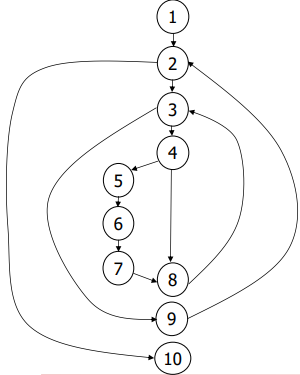

# Tema 5

## Introducción

Tipos de técnicas de diseño de pruebas:

- **Caja blanca**: Analiza la estructura interna y las conexiones del software.
- **Caja negra**: Examina entradas y salidas para identificar fallos en funciones, comportamiento y cumplimiento de requisitos.

## Principios que guían las pruebas de software

Las pruebas deben planificarse con base en los requisitos del cliente, comenzando de menor a mayor escala. 
Para mayor efectividad, deben realizarlas terceros independientes, ya que las pruebas exhaustivas no son viables.

## Características de un buen caso de prueba

Un buen caso de prueba tiene alta probabilidad de detectar errores y no es redundante. 
Debe ser el mejor en su categoría, equilibrando la simplicidad y la complejidad.

## Pruebas de caja blanca

Las pruebas de caja blanca (o pruebas estructurales) se enfocan en diseñar casos de prueba basados en la estructura de control del módulo, asegurando la cobertura de todos los caminos, condiciones, bucles y estructuras de datos internas. Aunque no es posible probar todos los caminos, se seleccionan los más importantes para asegurar su validez.

### Pruebas del camino básico

Fueron propuestas por `Tom McCabe`. Permite obtener la **complejidad ciclomática** de un programa. Esta se emplea para poder definir un conjunto básico de caminos. Estas son el conjunto de fórmulas
que hay que tener en cuenta:

$$
V(G) =
\begin{cases} 
    \text{número de predicados + 1} \\ 
    \text{numero de caras} \\
    \text{número de aristas - número de vértices + 2}
\end{cases}
$$

Vamos a realizar un ejemplo para ir adquiriendo la términología. Este es el código que vamos a analizar:

```java 
public void ordenar() {
    int size = lista.length;
    for (int i = 0; i < size; i++) {
        for (int j = size - 1; j > i; j--) {
            if (lista[j] < lista[j - 1]) {
               int aux = lista[j];
                lista[j] = lista[j - 1];
                lista[j - 1] = aux;
            }
       }
    }
}
```
1. Enumeramos las líneas de código, si ambas son secuenciales se pueden agrupar. Por ejemplo, las líneas 5, 6 y 7 se pueden agrupar en un solo nodo 5-7.

```java 
public void ordenar() {
1.    int size = lista.length;
2.    for (int i = 0; i < size; i++) {
3.        for (int j = size - 1; j > i; j--) {
4.            if (lista[j] < lista[j - 1]) {
5.               int aux = lista[j];
6.                lista[j] = lista[j - 1];
7.                lista[j - 1] = aux;
8.            }
9.        }
10.    }
}
```

2. Dibujamos el grafo de flujo de control. Si hay un bucle, un condicional o un operador ternario, se cuenta como un predicado y se hace una bifurcación:



Para poder hacer uso de las fórmulas, necesitamos contar el número de nodos, aristas y vértices.
- Un `nodo/vértice` es una o varias líneas de código. Varias es cuando se han agrupado por la secuencialidad.
- Una `arista` es una conexión entre dos nodos.
- Las `caras` son espacios entre las aristas. Hay una adicional por afuera del grafo.

Si lo localizamos en el grafo, tenemos que:

- Número de vértices: 10
- Número de aristas: 12

$$
V(G) =
\begin{cases} 
    \text{(2 for y 1 if) + 1 = 4} \\ 
    \text{3 caras + 1 exterior = 4} \\
    \text{12 aristas - 10 vértices + 2 = 4}
\end{cases}
$$

Por lo tanto, la complejidad ciclomática es 4. Esto significa que hay 4 caminos básicos que se pueden seguir. Para poder hacer las pruebas, se deben seguir los caminos que se han definido.

3. Definimos los caminos básicos. Para ello, se deben seguir las bifurcaciones del grafo. se debe de cumplir que cada camino pase por al menos una arista diferente al resto de caminos.

- Camino1: 1-2-10
- Camino2: 1-2-3-9-2-10
- Camino3: 1-2-3-4-8-3-9-2-10
- Camino4: 1-2-3-4-5-6-7-8-3-9-2-10

4. Los caminos básicos se convierten en casos de prueba. Se deben de seguir los caminos y se deben de anotar los valores que se han obtenido en cada paso. El valor obtenido puede diferir del esperado, por lo que se debe de anotar. Puede ocurrir el caso de que hayan caminos que no sean posibles.

```java
Camino1: 
Test#1 testOrdenarListaVacia()
Entrada: lista = []
Salida: lista = []
```

```java
Camino2:
Test#2 testOrdenarUnElemento()
Entrada: lista = [1]
Salida: lista = [1]
```

Y asi sucesivamente con los 2 restantes.

### Pruebas de condición

Se centra en las condiciones lógicas contenidas en un módulo. Una condición lógica puede ser una expresión relacional:

```java
{<, <=, >, >=, ==, !=}
```

o un operador lógicos:

```java
{&&, ||, !}
```

Se debe probar cada condición del programa para asegurar que no contiene errores. 

**Guía para las pruebas de condición**:

- Para tipos ordenados se comprueba si es menor, igual o mayor. (3 pruebas)
- Para tipos no ordenados se comprueba si es igual o diferente. (2 pruebas)
- Para operadores lógicos se comprueba si es verdadero o falso. (2 pruebas)
- Para condiciones compuestas se prueba todas las combinaciones posibles. Ejemplo: `if (a > b && not c)` 3 * 2 = 6 posibles caminos.


### Pruebas de flujo de datos

Selecciona caminos de prueba en función de la **definición** (escritura) y **uso** (lectura). Cada variable se considera un flujo de datos que puede definirse o modificarse en una sentencia del programa. Vamos a ver un ejemplo:

1. Enumeramos las líneas de código y se establecen los conjuntos de definición y uso. Una definición es tanto una declaración como una asignación. Un uso es una lectura o una operación con la variable.

```java
1   s:= 0;              DEF(1):= {s}, USO(1):= {}
2   x:= 0;              DEF(2):= {x}, USO(2):= {}
3   while (x<y) {       DEF(3):= {}, USO(3):= {x, y}
4       x:=x+3;         DEF(4):= {x}, USO(4):= {x}
5       y:=y+2;         DEF(5):= {y}, USO(5):= {y}
6       if (x+y<10)     DEF(6):= {}, USO(6):= {x, y}
7           s:=s+x+y;   DEF(7):= {s}, USO(7):= {x, y, s}
8       else s:=s+x-y;  DEF(8):= {s}, USO(8):= {x, y, s}     
9       endif           DEF(9):= {}, USO(9):= {}
10  }                   DEF(10):= {}, USO(10):= {}
```

2. Esto se hace para comprobar cadenas definición-uso (DU), por ejemplo [x, S, S']:

- **x** es una variable que se define en una sentencia solo una vez durante ese rango.
- **S** la sentencia donde la variable x se define.
- **S'** la sentencia donde la variable x se utiliza.
Se debe buscar un camno que desde **S** a **S'** no haya otra definición de **x**.

Ejemplos: [s, 1, 7], [s, 1, 8], [x, 2, 4], [x, 4, 8]

Se debe garantizar que cada cadena definición-uso se ejecuta al menos una vez con los métodos de prueba aunque no garantiza que se cubran todas las ramas.

### Pruebas de bucles

Solo se centra en la validez de los bucles. Según el tipo de bucle se realiza una acción diferente:

- **Bucle simple**: probar las posibles combinaciones posibles de los bucles, con n iteraciones:
    - No se ejecuta el bucle.
    - Se ejecuta una vez.
    - Se ejecuta m veces siendo m < n 
    - Se ejecuta n veces.
    - Se ejecuta n+1 veces.
- **Bucle anidados**: Mayor anidamiento es sinónimo de crecer geométricamente el número de pruebas.
    - Comenzar por bucle más interno y limitar el resto con valores mínimos o constantes. Al bucle interno sele hacen pruebas de `bucle simple`.
    - Una vez que hayas probado el bucle más interno, comienza a incluir pruebas para los bucles externos, manteniendo valores mínimos o típicos para los bucles más internos.
    - Finalmente, pruebalos todos.

- **Bucle concatenados**: Hay dos tipos de bucles concatenados:
    - **Bucles concatenados independientes**: Se prueban los bucles como si fueran simples.
    - **Bucles concatenados dependientes**: Como el contador del primer bucle afecta el funcionamiento del segundo bucle se fija el valor de un bucle como inicio del otro y se tratan como si fueran bucles anidados.

## Pruebas de caja negra

Las pruebas de caja negra se centran en derivar casos de prueba basados en los requisitos funcionales del programa mediante la entrada, sin conocer su estructura interna. Este enfoque complementario a la caja blanca se enfoca en el comportamiento y en descubrir errores que no se detectan con las pruebas estructurales.

### Particiones de equivalencia

Una **clase de equivalencia** es un conjunto de estados válidos o inválidos para una entrada. Este método consiste en dividir el dominio de entrada en clases de este tipo. Se asume que si una condición falla, todas las demás también lo harán.

**Guía para las particiones de equivalencia**:

- Cuando hay un rango o un valor específico, se hacen una clase válida y dos inválidas. Ejemplo: rango de 1 a 100, clase valida sería entre 1 y 100, y las inválidas serían menor a 1 y mayor a 100.
- Si la condición es un elemento de un conjunto o un booleano, se define una clase válida y una inválida. Ejemplo: si es un booleano, una clase sería verdadero y la otra falso.
- Todas las clases deben estar enumeradas, combinar clases válidas con una inválida.

### Método de análisis de valores límite	

Este método plantea que en los límites es donde se encuentran la mayoría de los errores. Consiste en generar casos de prueba cuando hay un rango entre a y b para a, b, a - 1, b - 1, a + 1, b + 1. 

**Sea un campo de texto para el nombre del usuario que admite un máximo de 30 caracteres y como mínimo 2.**

Se harían 6 test
```
Test#1: introducir sólo un carácter (a - 1)
Test#2: introducir 2 caracteres (a)
Test#3: introducir 3 caracteres (a + 1)
Test#4: introducir 29 caracteres (b - 1) 
Test#5: introducir 30 caracteres (b)
Test#6: introducir 31 caracteres (b + 1)
```

### Métodos de prueba basados en grafos

Se basa en la representación de los objetos y las relaciones entre ellos. Se pueden representar los objetos importantes en un grafo y se pueden seguir los caminos para hacer las pruebas. cada nodo es un objeto y cada arista es una relación. Los atributos o propiedades pueden hacer de pesos en las aristas.
