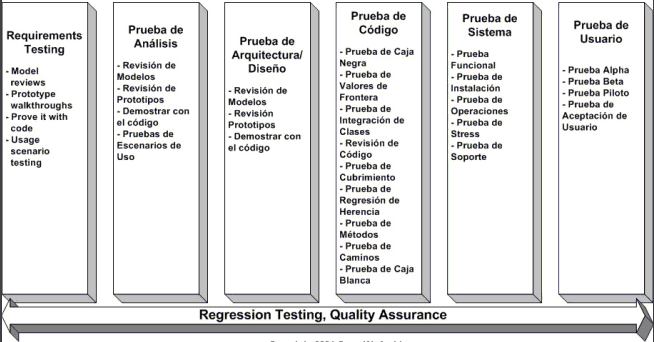
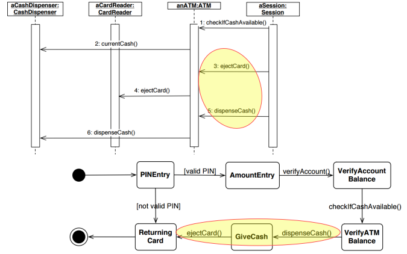
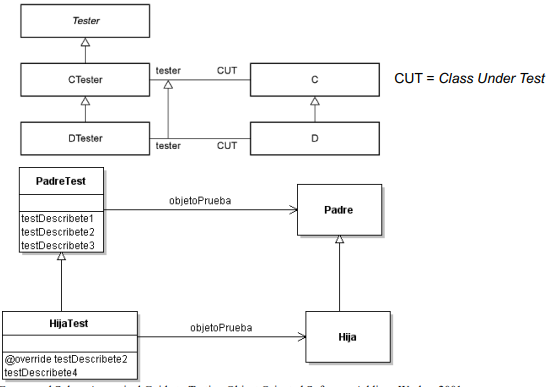

# Tema 6

## Introducción

A la hora de afrontar un proyecto, el coste de la fase de desarrollo puede crecer exponencialmente si no se detectan errores en etapas tempranas.
La mayoría suelen proceder de la fase de análisis y diseño. No solo podemos limitarlos a probar solo el código, sino que también podemos probar otro tipo de artefactos como los modelos, los casos de uso, etc.

Antes de llegar al código, es aconsejable revisar modelos (análisis y diseño) para evitar su propagación. Se suele pensar 
una serie de ideas que pueden ocasionar malentendidos:

- **"Con objetos se disminuyen las pruebas"**: Clase heredada de clase testeada != clase sin errores. Se debe probar también los métodos
en la clase hija.

- **"Las técnicas de pruebas estructuradas son suficientes"**: Las pruebas estructuradas no consideran la variabilidad de estados 
porque están enfocadas en analizar la lógica del código estático y no en cómo el estado dinámico del objeto afecta su comportamiento. 
Para cubrir esta brecha, se necesitan pruebas específicas orientadas al estado, que evalúen múltiples combinaciones de valores de 
atributos y simulen las transiciones de estado del objeto a lo largo de su ciclo de vida. Esto provoca problemas con el polimorfismo, encapsulación o el propio estado del objeto.

- **"Es suficiente con probar la interfaz gráfica"**: Hay que probar tanto lo que se ve como lo que no se ve.

## Metodología de pruebas OO de ciclo de vida completo (FLOOT)

La metodología FLOOT (Full Life-cycle Object-Oriented Testing) es una metodología de pruebas aplicables durante todas las etapas del desarrollo
orientada verificar y validar software OO. En la Figura 1 podemos apreciar:

- Los primeros 3 conforman un bloque de prueba del modelo/s establecidos. (1)
- El siguiente muestra algunas de las pruebas vistas comentadas como la de caminos, blanca, negra que representan a las pruebas de unidad y de integración. (2)
- Los últimos 2 fueron vistos en el tema 4 con las pruebas de aceptación/validación y las de sistema.

Comentaremos la sección (1) y (2) puesto que en OO cambian respecto a la programación estructurada.

## Técnicas de prueba de modelos OO

En la fase de toma de requisitos, análisis y diseño se generan artefactos que deben probarse. La metodología FLOOT propone 5 técnicas:

### T1) Probar con código

Realizar ciclos cortos de modela-codifica-prueba para detectar errores rápidamente.

### T2) Walkthroughs/Revisiones de prototipos

Utilizar prototipos para realizar pruebas basadas en escenarios de uso antes de desarrollar la aplicación completa.

### T3) Pruebas de interfaces de usuario

Verificar que la IU cumple estándares organizacionales y requisitos definidos.

### T4) Revisiones de modelos

Se debe hacer una revisión tanto **sintáctica** (seguir ciertas convenciones de modelado) como **semántica** (el modelo refleja el problema que se está modelando). Se dice
que un modelo es **inconsistente** cuando las partes que lo forman no encajan bien entre sí o se contradicen.

Ejemplo, en la figura 2, primero en el diagrama de secuencia, se realiza primero ejectCard y luego dispenseCard pero en el diagrama de estados se realiza al revés.

Necesitamos evaluar tanto el modelo de clases como de diseño. Para el modelo de clases, se pueden utilizar las siguientes técnicas:

- **CRC (Class-Responsibility-Collaboration)**: Se realiza una tabla con las clases, responsabilidades y colaboradores. Se puede detectar si una clase tiene demasiadas responsabilidades o si hay clases que no se comunican con otras. Para cada clase, hay que comprobar tanto los colaboradores como las responsabilidades. Una técnica consiste en invertir las conexiones para ver si se envían mensajes innecesarios. Sigue un formato:
    - **Nombre**
    - **Responsabilidades**: Hace referencia a las operaciones que puede realizar la clase.
    - **Colaboradores**: Hace referencia a las clases con las que se comunica.
- **Diagramas de relaciones**.

Para el modelo de diseño, se pueden utilizar las siguientes técnicas:

- **Revisión del diseño del sistema**: 
    - 1. Compruebas los subsistemas asignados y como realizan los comportamientos asignados.
    - 2. Compruebas la coherencia entre los subsistemas y sus comportamientos haciendo ejecuciones concurrentes.
    - 3. Compruebas que los casos de uso cuadren con el diseño de la IU.
- **Revisión de modelos de objetos**: Ver si todas las clases comprobadas en el modelo de clases tienen los atributos y operaciones necesarios. 

### T5) Probar escenarios de uso

Hemos visto formas de revisar los requisitos, modelos y diseño. Ahora vamos a ver como probar el conjunto entero: el dominio. Para ello se emplean los **escenarios de uso** cuya función es dar una serie de pasos que describen dada una situación inicial, cómo se comporta el sistema ante las acciones del usuario. 

Para ello, se pueden seguir los siguientes pasos:

1. Creamos un modelo de dominio.
2. Buscamos varios escenarios reales que puedan suceder.
3. Repartes las tarjetas CRC a las personas que colaboren intentando que no repitan tarjetas con colaboraciones en común.
4. Describir la representación del escenario.
5. Actuar según el escenario a probar simulando el paso de mensajes entre clases con **pelotas**. Si hay alguna clase/responsabilidad no tenida en cuenta se añade.
6. Se guarda el escenario para futuras pruebas y para su uso en las pruebas de aceptación.

## Técnicas de prueba de código OO

Como mencionemos anteriormente, las pruebas estructuradas no son suficientes para probar código OO. Se necesita una serie de técnicas específicas para `ejercitar` los estados de una clase.

### Pruebas de métodos (Pruebas de unidad)

Comprueba que una operación funciona correctamente de forma aislada. Es decir, tanto parámetros, como funcinalidad y mensajes de error cumplen la especificación de dicho método. Al comprobar métodos de manera aislada no garantizas que un método provoque efectos indeseados en otros. Se deben probar tanto métodos normales como constructores, destructores, métodos de encapsulación, etc.

### Pruebas de clases (Pruebas de integración para los métodos de una clase)

Comprueba que las operaciones y propiedades de una clase funcionan de correctamente de forma conjunta. No garantiza que una clase funcione correctamente con otras, es decir, Pruebas de clase != Pruebas de integración. Hay dos formas de probar una clase:

- **Pruebas aleatorias**: Secuencia aleatoria de métodos de una clase.
- **Pruebas de partición**: Categorizas la clase y haces pruebas para cada partición.
    - **Basado en estados**: Estableces una prueba mínima (secuencia de métodos fijos que van en orden y no cambian) y pruebas tanto los métodos que cambian de estado como los que no mediante una serie de secuencias mínimas.
    - **Basado en atributos**.
    - **Basado en categorías**.

### Pruebas de colaboraciones de clases

Comprueba que varias clases funcionan de forma conjunta. Se aproximaría a las pruebas de integración de la programación estructurada. Se pueden realizar pruebas de colaboración de clases de tres formas:

- **Pruebas aleatorias**:
    - 1. Defines secuencias de prueba para cada clase son sus métodos. Algunos de estos métodos involucrarán a otras clases. Ej: Para una clase máquina_expendedora, métodos serían: introducir_moneda, seleccionar_producto, devolver_cambio. Seleccionar producto involucra a la clase producto. La clase producto tiene los métodos: comprobar_stock, devolver_precio.
    - 2. Para aquellos métodos que involucren a otras clases, ver cual es la clase colaboradora e identificarlo con la que se lo sirve. Ej: Para máquina_expendedora y producto: seleccionar_producto (máquina_expendedora) y comprobar_stock (producto), devolver_precio (producto).
    - 3. Para cada clase colaboradora, defines los mensajes producidos. Ej: Para producto, comprobar_stock y comprobar_precio.
    - 4. Para los mensajes producidos, añades esos métodos a la secuencia de prueba inicial. Ej: Para máquina_expendedora,**introducir_moneda, seleccionar_producto, comprobar_stock, devolver_precio, devolver_cambio**.

- **Pruebas de partición**:
    - 1. Defines en cada clase sus particiones y una serie de secuencias de prueba. Ej: En una clase de cajero, particiones serían: introducir_tarjeta, introducir_pin, seleccionar_operación y retirar_dinero. De una clase tarjeta serían: comprobar_pin, 
    - 2. Extiendes las particiones para incluir mensajes de las clases que colaboren. Ej: Para cajero y tarjeta: **introducir_tarjeta, introducir_pin, comprobar_pin, seleccionar_operación, retirar_dinero**.

- **Pruebas basadas en modelos de comportamiento**: Casos de prueba que tengan en cuenta los estados de la clase. Es pruebas de partición basado en estados pero añadiendo métodos que cambien el estado de una clase desde otras. Debe de intentar pasar por todos los estados posibles de la clase.
- **Pruebas basadas en escenarios de uso**: Se centran en que hace el usuario. Los test se crearán a partir de lo que el usuario tiene que realizar. Ej: Para una clase de cajero, el usuario tiene que introducir tarjeta, introducir pin, seleccionar operación y retirar dinero. Es decir esta teniendo en cuenta la clase cajero y la clase tarjeta.

### Pruebas de herencia

Asegura que nuevas subclases funcionan correctamente. Estos son los casos donde hay que volver a probar los métodos de la clase padre en la clase hija. Se pueden dar los siguientes casos:

- El método heredado depende de otro redefinido
- Núevos métodos
- Métodos redefinidos: Que los métodos funcionen en la clase padre no garantiza que funcionen en la clase hija. **Pruebas de regresión**.

**Sólo hay que escribir los casos de prueba de los nuevos requisitos del método redefinido que no estén cubiertos por las pruebas de la clase padre**. Es decir, los 3 casos anteriores.

Se debe seguir la metodología CUT (Class under test) para probar la herencia. Es decir, al igual que las clases hijas herendan del padre, las clases de prueba también deben heredar de la clase padre en los tests.

