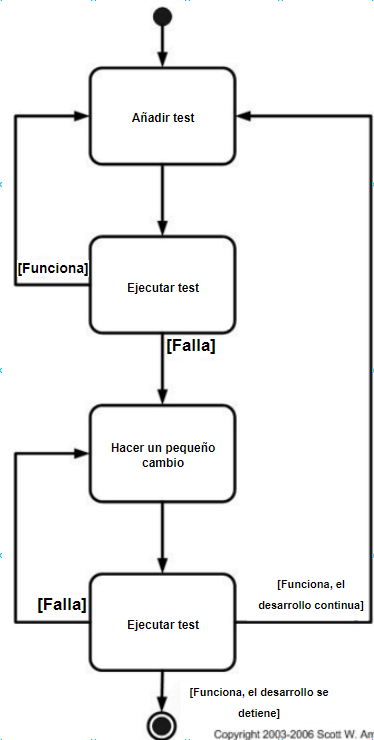

# Tema 7

## Introducción

**TDD** (Test-Driven Development) es una técnica de desarrollo de software que consiste en escribir primero las pruebas y después el código que las hace pasar (TFD). Es una técnica de programación de desarrollo ágil (XP - eXtreme Programming). Enfocándose en los requisitos y diseño  mejoras la fiabilidad al desarrollar características más precisas para el usuario. En general, tenemos que:

**TDD = TFD + Refactorización**

## Ciclo básico del TDD

En la figura 1 se muestra el ciclo básico del TDD. Partimos de un test que falla, escribimos el código necesario para que pase el test y, finalmente, refactorizamos el código una vez que el test ha pasado siempre y cuando no toquemos la funcionalidad. Por cada fallo, buscamos realizar cambios mínimos en el código para que pase el test. 

**Beneficios del TDD**

- **Reducción de defectos**: De 60% a 90% menos de defectos (~Microsoft). Los ciclos de retroalimentación rápidos y la definición de nuevos tests reducen los defectos por suposiciones incorrectas y por ajustes en el diseño al añadir nuevas funcionalidades. Los tests de regresión ayudan a evitar problemas en el código existente.
- **Reducción del tiempo de desarollo**: El código es más limpio y fiable.
- **Diseñar lo justo y necesario**: Evitas over-design.

**Costes del TDD**

- **Proporción código Pruebas-Producción**: 2:1
- **Aprendizaje**: Curva de aprendizaje.
- **Mantenimiento de los tests**: Los tests deben mantenerse al día junto con el código.

## Niveles del TDD

**¿Qué es un test de aceptación?**

Los test de aceptación son frases cortas y precisas escritas en el lenguaje del dominio del negocio. De esta manera, el cliente las lee y las entiende. Se suelen hacer con las ayudas de los escenarios de usuario vistos en el tema anterior. Deben cumplir los requisitos que el cliente demanda. Cada historia de usuario tiene un conjunto de tests de aceptación. Escritos por **clientes**, **desarrolladores** y **testers**.

- **Desarrollo Dirigido por Test de Aceptación (ATDD)**: Se escriben los tests de aceptación antes de escribir el código. por cada test de aceptación habrá un conjunto de test unitarios. 
- **TDD del Desarrollo**: Lo visto hasta ahora de TDD convencional con test unitarios.

**¿Qué es un documento de características?**

Documento de especificación de requisitos que cumple las siguientes características:

- **Legibilidad**: Entendible por los stakeholders.
- **Ejecutable**.
- **Sincronización test-código**.

Se suele usar **Gherkin** para los escenarios y **Cucumber** como entorno de ejecución. Para poder familiarizarte con TDD, se suele hacer el uso de Katas para adquirir la habilidad de escribir tests antes de escribir el código.

## TDD con objetos: objetos mock

Objeto mock (objetos de imitación o sustitución) describe objetos que imitan a objetos reales para hacer pruebas. Con ellos, se puede comproar si han sido llamados como se esperaba y devolver valores por defecto para simular el comportamiento. Herramientas como **Mockito**, **JMock** o **EasyMock** permiten crear objetos mock.

## Comparativa: Stub vs Mock

| Característica             | **Mock**                                           | **Stub**                                           |
|----------------------------|----------------------------------------------------|----------------------------------------------------|
| **Definición**              | Prueba basada en interacciones entre objetos.      | Prueba basada en el estado de los objetos.        |
| **Propósito principal**     | Verificar que se han realizado las interacciones esperadas (llamadas a métodos). | Simular el comportamiento de objetos colaborativos, proporcionando respuestas predeterminadas. |
| **Expectativas**            | Se definen expectativas sobre las interacciones (llamadas a métodos). | No tiene expectativas definidas, solo devuelve valores predeterminados. |
| **Verificación**            | Se verifica que las interacciones esperadas ocurran. | Se verifican los resultados del estado del objeto. |
| **Tipo de prueba**          | Basada en comportamientos (interacciones).         | Basada en datos (estado del objeto).              |
| **Uso común**               | Verificar que se han realizado ciertas llamadas o acciones (ej. enviar un correo). | Simular respuestas a métodos de consulta (ej. número de elementos en una base de datos). |
| **Ejemplo**                 | Verificar que el método `enviarCorreo()` fue llamado en un objeto. | Verificar que el número de correos enviados es 1.  |
